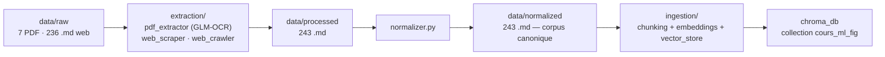
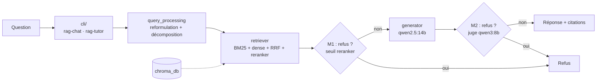

# Tuteur Pédagogique RAG

Système de tutorat pédagogique fondé sur une architecture **RAG** (*Retrieval-Augmented
Generation*) **100 % locale**, appliqué à un corpus de cours de machine learning.

Le tuteur répond aux questions d'un étudiant en s'appuyant **exclusivement** sur le corpus
indexé : ancrage documentaire strict, citations obligatoires, et **refus explicite** quand
le corpus ne permet pas de répondre. Il est fourni sous deux interfaces :

| Interface | Usage | Mémoire | Streaming |
|---|---|---|---|
| `rag-chat` | questions/réponses directes (mode évaluation) | non | non |
| `rag-tutor` | tuteur conversationnel socratique | oui | oui |

---

## Fonctionnalités

- **Retrieval hybride** : BM25 (sparse) + embeddings denses (`bge-m3`), fusion **RRF**,
  reranking par cross-encodeur (`bge-reranker-v2-m3`), avec remontée des chunks parents.
- **Query processing** : reformulation de la question + décomposition en sous-questions.
- **Refus à deux niveaux** : `M1` (seuil sur le score du reranker) puis `M2`
  (vérification par un juge LLM `verify_answer`).
- **Tutorat socratique** : prompt dédié, mémoire conversationnelle, compression d'historique.
- **Évaluation** : métriques retrieval (`Hit@k`, `MRR`, `Precision@k`, `NDCG@k`) + Ragas
  (`faithfulness`, `context precision`) + calibration du seuil de refus.

## Architecture

Le système est séparé en deux phases indépendantes : une **préparation offline** (extraction
→ normalisation → indexation) et une **exécution par question** (retrieval → génération → refus).

### Préparation offline (pipeline de données)



### Exécution par question (pipeline RAG)



## Technologies

| Rôle | Technologie | Où |
|---|---|---|
| Génération | `qwen2.5:14b` via **Ollama** | `core/llm_client.py` |
| Juge de vérification (M2) | `qwen3:8b` via Ollama | `core/generator.py` |
| Embeddings | `bge-m3` via Ollama `/api/embed` | `core/embeddings.py` |
| Reranker | `BAAI/bge-reranker-v2-m3` via **sentence-transformers** | `core/retriever.py` |
| Sparse retrieval | `rank-bm25` | `core/retriever.py` |
| Vector store | **ChromaDB** (persistant, espace cosinus) | `core/vector_store.py` |
| OCR PDF | **GLM-OCR** (`glmocr[selfhosted]`) + layout `PP-DocLayoutV3` | `extraction/pdf_extractor.py` |
| Description de figures | `qwen3-vl:8b` via Ollama | `extraction/pdf_extractor.py` |
| Lecture PDF | PyMuPDF (`fitz`) | `extraction/pdf_extractor.py` |
| Scraping | `requests` + `BeautifulSoup` + `markdownify` + `trafilatura` | `extraction/` |
| Évaluation | `ragas`, `langchain-ollama`, `deepeval` | `evaluation/` |

## Prérequis

- **Python ≥ 3.11**.
- **Ollama** actif sur `localhost:11434`, avec les modèles suivants :
  `qwen2.5:14b`, `qwen3:8b`, `bge-m3`, `glm-ocr:latest`, `qwen3-vl:8b`.
- Le reranker `bge-reranker-v2-m3` est chargé par `sentence-transformers` (téléchargé au
  premier usage, ou servi depuis le cache HuggingFace local).

## Installation

```bash
pip install -e .
```

Puis vérifier l'environnement (Python, dépendances, Ollama, modèles) :

```bash
make setup
```

> Le `pyproject.toml` référence un index `uv` pour `torch` (build CUDA 12.6) ; un GPU est
> recommandé pour l'OCR et la génération, mais le `Makefile` désactive CUDA par défaut
> (`CUDA_VISIBLE_DEVICES=`), donc le pipeline tourne aussi sur CPU.

## Configuration

- **`config/config.yaml`** — configuration du **GLM-OCR** uniquement (extraction PDF) :
  endpoint Ollama, modèle `glm-ocr:latest`, layout, seuils, prompts.
- **Les paramètres runtime sont des constantes dans `core/`** : `GEN_MODEL`, `EMBEDDING_MODEL`,
  `RERANKER_MODEL`, `DB_DIR=chroma_db`, `COLLECTION_NAME=cours_ml_fig`, le seuil de refus
  `RERANKER_REFUSAL_THRESHOLD`. Ils ne sont pas lus depuis l'environnement.
- **`.env.example`** documente ces valeurs par défaut (aucune variable n'est lue au runtime ;
  le `Makefile` exporte seulement `HF_HUB_OFFLINE`, `CUDA_VISIBLE_DEVICES` et `TQDM_DISABLE`).

## Pipeline de données

Le corpus passe par quatre niveaux, tous versionnés dans `data/` :

| Niveau | Contenu | Produit par |
|---|---|---|
| `data/raw/` | sources brutes : 7 PDF (`pdf/`) + 236 `.md` web (`web/`) | manuel |
| `data/processed/` | sortie d'extraction (243 `.md`) | `extraction/` |
| `data/normalized/` | corpus canonique unifié (243 `.md`), entrée d'indexation | `normalizer.py` |
| `chroma_db/` | index ChromaDB persistant | `ingestion/` |

```bash
# Extraction d'un PDF (GLM-OCR)
python -m rag_tutor.extraction.pdf_extractor cours.pdf --config config/config.yaml --out cours.md

# Scraping d'une page web unique
python -m rag_tutor.extraction.web_scraper --url https://… --out data/processed/

# Crawl d'un site complet (découverte des pages + scraping)
python -m rag_tutor.extraction.web_crawler https://… --out data/processed/

# Normalisation d'un dossier PLAT de .md extraits vers le corpus canonique
python -m rag_tutor.extraction.normalizer ./bruts/ --out ./normalized/

# Indexation (chunking + embeddings + ChromaDB)
python -m rag_tutor.ingestion.ingest data/normalized/
```

L'indexation peut aussi être lancée via le Makefile (c'est le chemin canonique) :

```bash
make ingest DIR=data/normalized
```

## Utilisation

```bash
# Tuteur conversationnel socratique (mémoire + streaming)
rag-tutor

# Questions/réponses directes, avec affichage des sources
rag-chat --show-sources

# Équivalents Makefile
make tutor K=4 SHOW_SOURCES=--show-sources
make chat K=6
```

Arguments communs aux deux CLI : `--k` (passages récupérés), `--no-query-processing`,
`--no-refusal-gate`, `--show-sources`. Le tuteur ajoute `--recent-window`,
`--show-eval` (évaluation par question) et `--no-judge`.

## Évaluation

```bash
# Évaluation complète sur le golden dataset (défaut du Makefile)
rag-eval eval/golden_dataset_v2.json --retrieval-mode hybrid_rerank

# Équivalent Makefile (mode = dense | hybrid | hybrid_rerank)
make eval MODE=hybrid_rerank

# Ablation : comparer les modes de retrieval
rag-eval eval/golden_dataset_v2.json --retrieval-mode dense --no-ragas
```

Les jeux de données de `eval/` :

| Fichier | Rôle |
|---|---|
| `golden_dataset_v2.json` | golden dataset principal (défaut de `make eval` / `rag-eval`) |
| `test_set_v2.json` | jeu de test, utilisé pour calibrer le seuil de refus |
| `test_set.json` / `test_unanswerable_only.json` | jeux auxiliaires (test, sous-ensemble « non répondable ») |
| `reranker_calibration.json` | scores de calibration stockés (référence du seuil M1) |

Outils d'évaluation disponibles :

```bash
# Calibrer le seuil de refus (retrieval uniquement, sans génération)
python -m rag_tutor.evaluation.calibrate eval/golden_dataset_v2.json

# Générer un golden dataset (DeepEval Synthesizer)
python -m rag_tutor.evaluation.dataset_gen data/normalized --out eval/golden_dataset.json

# Valider le juge LLM (M2)
python -m rag_tutor.evaluation.validate_judge --generate
```

## Commandes Make

| Commande | Description |
|---|---|
| `make setup` | installe les dépendances + vérifie Python / Ollama / modèles |
| `make ingest DIR=data/normalized` | (ré)indexe le corpus dans ChromaDB |
| `make chat [K=4]` | lance le Q&A direct |
| `make tutor [K=4]` | lance le tuteur socratique |
| `make eval [MODE=hybrid_rerank]` | lance l'évaluation complète |
| `make clean` | supprime l'index ChromaDB et les caches Python |

## Structure du projet

```
.
├── Makefile                # cibles : setup / ingest / chat / tutor / eval / clean
├── pyproject.toml          # dépendances + points d'entrée rag-chat / rag-tutor / rag-eval
├── config/config.yaml      # configuration GLM-OCR (extraction PDF)
├── eval/                   # jeux de données d'évaluation
├── chroma_db/              # index vectoriel ChromaDB (généré par ingestion)
├── data/                   # corpus : raw/ → processed/ → normalized/
└── src/rag_tutor/
    ├── cli/                # chat.py (Q&A direct) · tutor.py (socratique)
    ├── conversation/       # memory.py (mémoire) · prompts.py (prompt socratique)
    ├── core/               # pipeline · query_processing · retriever · generator ·
    │                       # refusal_gate · llm_client · embeddings · vector_store · chunking
    ├── evaluation/         # evaluate · calibrate · dataset_gen · per_question · validate_judge
    ├── extraction/         # pdf_extractor · web_scraper · web_crawler ·
    │                       # clean_web_markdown · normalizer
    └── ingestion/          # ingest.py (indexation ChromaDB)
```

